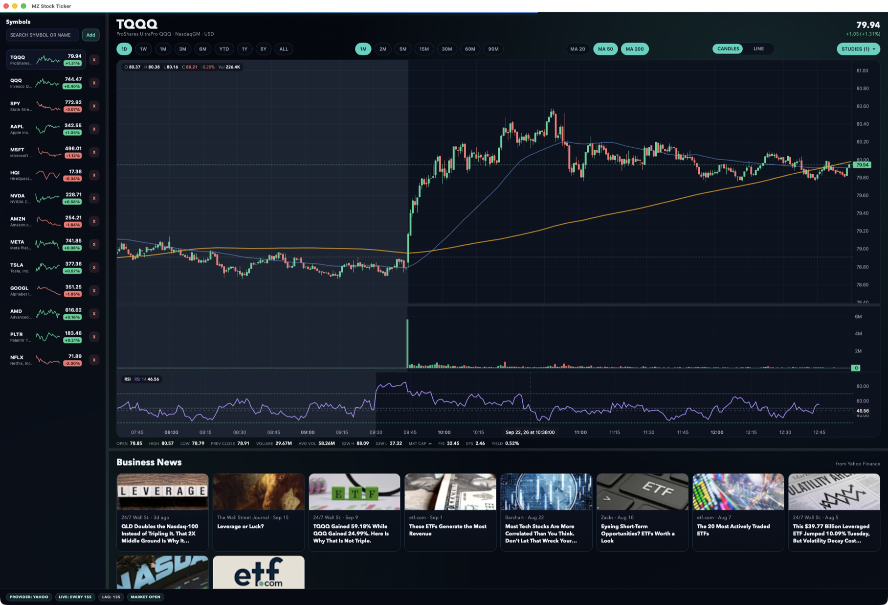
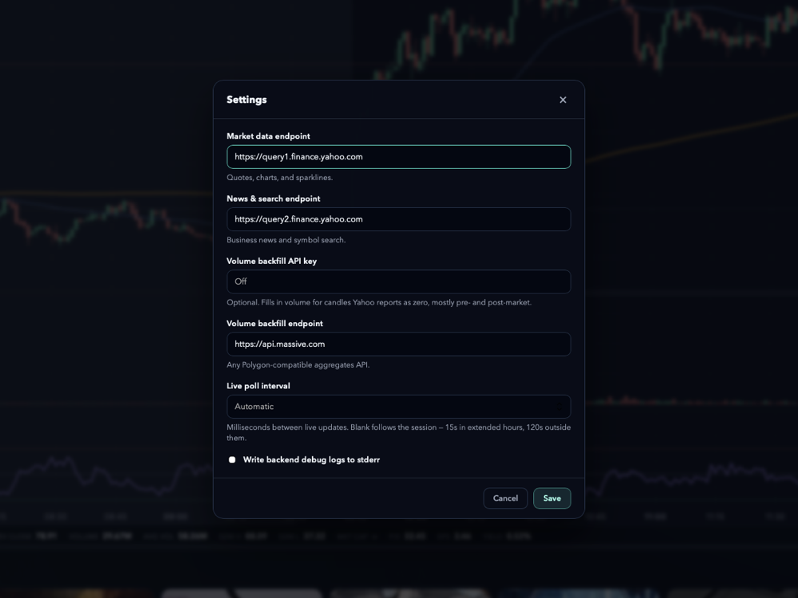

<div align="center">


# MZ Stock Ticker

**Open source native charting terminal. No account, no API key.**

Starts where Apple Stocks stops: a live watchlist next to real charting — 47
technical studies, candlesticks, key statistics, and market news — in a
lightweight app built with Tauri, Rust, and TypeScript.
Free for macOS, Windows, and Linux.

[](https://github.com/MZ-Industries/mz-stock-ticker/releases/latest)
[](https://github.com/MZ-Industries/mz-stock-ticker/releases)
[](https://github.com/MZ-Industries/mz-stock-ticker/actions/workflows/ci.yml)
[](https://tauri.app)
[](https://github.com/MZ-Industries/mz-stock-ticker/releases/latest)
[](LICENSE)

[Features](#features) • [Download](#download) • [Tips](#tips) • [Configuration](#configuration) • [Development](#development) • [Data notes](#data-notes)

<a href="https://github.com/MZ-Industries/mz-stock-ticker/releases/latest">
  
</a>

</div>

No account. No API key. No subscription. Add your symbols and go.

## Features

**Charts**

- Candle/line switch with a crosshair OHLC/volume legend
- Moving-average overlays (20 / 50 / 200) and a dedicated volume pane
- 47 technical studies from a filterable checklist — RSI, MACD, Stochastics, ADX/DMS, Bollinger Bands, Ichimoku, VWAP and more. Oscillators stack in their own panes under the volume chart; overlays draw on the price chart, each with its own crosshair readout
- Range presets from 1D to ALL, with infinite scroll-back that fetches older history as you approach it
- The 1D view holds several sessions: it opens on the latest one (pre-market included), scrolling left reveals prior days, and non-regular hours are shaded per session
- Previous-close reference line and a live trailing candle driven by a background poller

**Watchlist**

- Apple Stocks–style sidebar with sparklines; add, remove, and reorder symbols in place
- Symbol search with company-name autocomplete, showing exchange and type per result
- Change badges toggle between % and $ on click

**Statistics & news**

- Key statistics strip: open, day range, previous close, volume, average volume, 52-week range, market cap, P/E, EPS, and dividend yield
- News cards with thumbnails and relative timestamps — stories open in your default browser
- Status bar with data provider, live poll cadence, lag, and market session

**Quality of life**

- Resizable panes: sidebar width, price/volume split, and chart/news split
- Everything persists between launches — ticker, range, chart type, enabled studies, pane sizes, visible range, and window position
- Settings pane for the endpoints, the optional volume-backfill key, and the live poll cadence
- Updates check themselves in the background and install on a click; "Check for Updates" sits in the app menu, and automatic checking can be turned off there

## Download

Grab the latest build for your platform from the
[**Releases page**](https://github.com/MZ-Industries/mz-stock-ticker/releases/latest).

| Platform              | File to download                                     |
| --------------------- | ---------------------------------------------------- |
| macOS (Apple Silicon) | `MZ.Stock.Ticker_x.y.z_aarch64.dmg`                  |
| macOS (Intel)         | `MZ.Stock.Ticker_x.y.z_x64.dmg`                      |
| Windows               | `MZ.Stock.Ticker_x.y.z_x64-setup.exe` (or the `.msi`) |
| Linux                 | `.AppImage` (most portable), `.deb`, or `.rpm`       |

> [!NOTE]
> **macOS:** releases after v0.2.0 are signed and notarized. If you're running
> v0.2.0 (unsigned), Gatekeeper will report the app as "damaged" on first
> launch — after copying it to Applications, clear the quarantine flag:
>
> ```bash
> xattr -r -d com.apple.quarantine "/Applications/MZ Stock Ticker.app"
> ```

> [!NOTE]
> **Linux:** the AppImage needs to be made executable first —
> `chmod +x MZ.Stock.Ticker_*.AppImage`.

## Tips

| Action                              | How                                        |
| ----------------------------------- | ------------------------------------------ |
| Switch between watchlist symbols    | <kbd>↑</kbd> / <kbd>↓</kbd>                |
| Toggle % / $ change in the sidebar  | Click any change badge                     |
| Show OHLC + volume for a candle     | Hover the price chart                      |
| Load older history                  | Scroll left — more is fetched automatically |
| Resize sidebar / chart / news panes | Drag the dividers                          |

## Configuration

The app works out of the box, with no account and no API key. Everything below
is optional and lives in **Settings** — <kbd>⌘</kbd><kbd>,</kbd> or the
application menu on macOS, **Edit → Settings** on Windows and Linux.

<div align="center">
  
</div>

| Setting                    | Default                            | Purpose                                                                                              |
| -------------------------- | ---------------------------------- | ---------------------------------------------------------------------------------------------------- |
| Market data endpoint       | `https://query1.finance.yahoo.com` | Quotes, charts, and sparklines                                                                         |
| News & search endpoint     | `https://query2.finance.yahoo.com` | Business news and symbol search                                                                        |
| Volume backfill API key    | off                                | Fills in volume for candles Yahoo reports as zero, mostly pre- and post-market                          |
| Volume backfill endpoint   | `https://api.massive.com`          | Any Polygon-compatible aggregates API, used for that backfill                                          |
| Live poll interval         | automatic                          | Milliseconds between live updates. Blank follows the session — 15s in extended hours, 120s outside them |
| Backend debug logs         | off                                | Writes backend request logs to stderr                                                                  |

Saving takes effect on the next request — nothing here needs a restart. A blank
endpoint falls back to its default, and a poll interval under 1000ms goes back
to automatic. The values are stored in `settings.json` beside your dashboard
preferences (`~/Library/Application Support/com.matt.mz-stock-ticker` on macOS).

## Development

Prerequisites: [Node.js 20+](https://nodejs.org), a
[Rust toolchain](https://rustup.rs), and the
[Tauri prerequisites](https://v2.tauri.app/start/prerequisites/) for your OS.

```bash
git clone https://github.com/MZ-Industries/mz-stock-ticker.git
cd mz-stock-ticker
npm install
npm run tauri dev
```

Run the checks CI runs:

```bash
npm test                              # frontend unit tests (vitest)
npm run build                         # typecheck + bundle
cd src-tauri && cargo test            # backend tests
```

<details>
<summary><strong>Architecture notes</strong></summary>

The TypeScript frontend (Vite + [lightweight-charts](https://github.com/tradingview/lightweight-charts))
talks to a Rust backend over Tauri commands: `get_provider_status`,
`fetch_aggregates`, `fetch_snapshots`, `fetch_sparklines`, `fetch_news`,
`fetch_symbol_detail`, `search_symbols`, `get_settings` / `save_settings`, and
`start_live_stream` / `stop_live_stream`. The live stream republishes Yahoo's 1-minute bars as
`live-bars` events carrying the freshly polled candle tail. Dashboard
preferences and the Settings pane both persist via the Tauri Store plugin
(`ui-preferences.json` and `settings.json`); window geometry via
tauri-plugin-window-state.

Chart scrolling follows real time only while the newest candle is on screen
(lightweight-charts' `shiftVisibleRangeOnNewBar`); scroll back into history and
the view stays put.

</details>

### Releasing (maintainers)

Releases are automated with [release-please](https://github.com/googleapis/release-please):
conventional commits on `main` maintain a version-bump PR; merging it runs the
test suite, builds all four platform bundles, and publishes the GitHub release
only if everything passes.

## Data notes

- Market data comes from Yahoo Finance's **unofficial** endpoints, which can
  change without notice. The quote endpoint's cookie + crumb authentication is
  acquired and refreshed automatically.
- Yahoo rate-limits aggressively per IP. If the app sits in a 429 cooldown loop
  for a long time, the IP is likely temporarily banned — lower the request rate
  or wait it out.
- Intraday history is bounded by Yahoo's retention: 1m ≈ 30 days, 5m–30m ≈ 60
  days, hourly ≈ 2 years, daily unlimited. Quality and latency vary by symbol
  and session.

## License

[MIT](LICENSE) © Matt Sergeant

> [!WARNING]
> MZ Stock Ticker is for personal, informational use only. Nothing it displays
> is investment advice, and the data should not be relied on for trading.

---

<div align="center">

Built with [Tauri](https://tauri.app) and
[lightweight-charts](https://github.com/tradingview/lightweight-charts)

</div>
